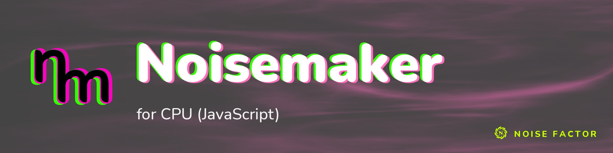

<!-- repo-hero -->
<a href="https://noisemaker.app/"></a>

<sub>Open source from <a href="https://noisefactor.io">Noise Factor</a> &middot; <a href="https://github.com/noisefactorllc">more projects</a></sub>

# noisemaker-cpu

Current measured support: [compatibility report](docs/COMPATIBILITY.md).

> This package supports the "Export Shader Pipeline" feature in Noisedeck.app. The feature runs shader compositions on other platforms. Noise Factor derives this package from the upstream Noisemaker Engine project and tests it for pixel-level parity.

This is not the classic JS Noisemaker (Composer) library. This is a new
effort centered around software shader execution.

A CPU-only backport of the Noisemaker shader engine, Polymorphic DSL, and standalone-frame canonical 2D shader collection. It renders in vanilla JavaScript in browsers or Node.js without WebGL, WebGPU, native addons, or runtime package dependencies.

The renderer is designed to reproduce a frame anywhere JavaScript runs, with the expectation that complex frames can be slow. CSL—CPU Shader Language—provides a compact GLSL-like language for custom CPU shaders. The upstream Noisemaker GLSL collection is translated ahead of time into ordinary ESM pixel kernels. Catalog rendering needs neither runtime evaluation nor the GLSL transpiler.

## Quick start

Node.js 22 or newer is required for the CLI.

```bash
node bin/noisemaker-cpu.js effect noise \
  --width 256 --height 256 \
  --param scaleX=18 --param scaleY=12 \
  --output noise.png

printf 'search synth, filter\nnoise(scaleX: 18, scaleY: 12).posterize(levels: 8).write(o0)\nrender(o0)\n' |
  node bin/noisemaker-cpu.js render - \
    --width 256 --height 256 --seed 11 \
    --output showcase.png
```

Use an input image or named texture:

```bash
node bin/noisemaker-cpu.js effect filter/texture \
  --input source.png --output texture.png

node bin/noisemaker-cpu.js render program.dsl \
  --texture imageTex=source.png \
  --texture textTex=mask.png \
  --output result.png
```

The renderer checks custom CSL uniform types against their declarations. Use `--uniform color=[1,0.5,0]` and `--uniform enabled=true` for uniforms. Use `--texture inputTex=source.png` for samplers.

Render from standard input:

```bash
printf 'search synth\nsolid(color: #f80).write(o0)\nrender(o0)\n' |
  node bin/noisemaker-cpu.js render - --width 128 --height 128 --output solid.png
```

Useful commands:

- `node bin/noisemaker-cpu.js effects` lists the complete catalog.
- `npm test` verifies the engine.
- `npm run compile:upstream` deterministically rebuilds the canonical kernels.
- `npm run parity` compares all default frames with GPU goldens.
- `npm run bench -- --size 128` measures local throughput.

`noisemaker-cpu effect EFFECT` automatically connects every catalog domain:

- Volume generators receive a renderer.
- Volume filters/renderers receive a deterministic `noise3d` source.
- Either loop marker receives its balanced partner.

`apply` remains image-only and reports a direct error for typed volume/loop domains. Use `effect` or `render` for those chains.

## Browser API

The main entry has no Node imports:

```js
import {
  CpuRenderer,
  createDefaultRegistry,
  kernelFactories,
  kernels,
} from './src/index.js'

const renderer = new CpuRenderer({
  registry: createDefaultRegistry(),
  kernels,
  kernelFactories,
})

const result = renderer.render(`
  search synth, filter
  noise(scaleX: 18, scaleY: 12)
    .posterize(levels: 8)
    .write(o0)
  render(o0)
`, { width: 256, height: 256, time: 0.25, seed: 11 })

const bytes = result.toRgba8()
```

The render-level integer `seed` supplies omitted effect seed parameters. A seed written explicitly in the DSL takes precedence. External browser images can be converted to a `Surface` and passed through `externalTextures`.

Initialized fibers, scratches, and stray-hair overlays use a 64 MiB LRU cache by default. Set the limit with `cpuTextureCacheByteLimit` in the `CpuRenderer` constructor. Inspect the cache with `cpuTextureCacheStats()`. Release retained overlays with `clearCpuTextureCache()`/`dispose()`.

For a canvas, call `renderToCanvas(canvas, dsl, options)` or `await renderToCanvasAsync(...)`. The asynchronous form yields between scanline tiles so the page can update while the CPU works. A browser demo is in `examples/browser`: build a Polymorphic-DSL effect pipeline from the full effect catalog and watch it render on the CPU. Serve the repository over HTTP (for example `python3 -m http.server`). Open `examples/browser/index.html`.

## CSL

Custom CPU shaders use GLSL-like syntax and return one `vec4`:

```glsl
uniform vec3 color = vec3(1.0, 0.5, 0.0);
uniform float bands = 8.0;

vec4 main() {
  float value = sin(uv.y * bands * 6.2831853 + time) * 0.5 + 0.5;
  return vec4(color * value, 1.0);
}
```

```js
import { compileCsl } from './src/index.js'

const shader = compileCsl(source, { sourceName: 'bands.csl' })
```

Runtime compact-CSL compilation uses `Function` after parsing and whitelist-based type checking. Compile only shader source you trust. Catalog kernels use the separate canonical-GLSL compatibility lane and ship as generated ESM suitable for a strict Content Security Policy. See [docs/CSL.md](docs/CSL.md).

## Polymorphic DSL

```text
search synth, filter, mixer
let tuned = noise(scaleX: 15, scaleY: 9)
tuned(seed: 3).posterize(levels: 7).write(o0)
solid(color: #24f).write(o1)
read(o0).blendMode(tex: o1, mode: screen).write(o2)
render(o2)
```

The frontend preserves the canonical effect schemas, aliases, defaults, compile-time choices, pass graphs, named surfaces, generators, filters, and mixers. It supports explicit search order, positional or named arguments, value/effect partial bindings, `read(oN)`, chainable `.write(oN)`, and `render(oN)`. Stateful, particle, flattened-volume, and balanced `loopBegin`/`loopEnd` operations compile and render through the same DSL (see [docs/EFFECTS.md](docs/EFFECTS.md)). `render` doubles as both the `render(oN)` directive keyword and the namespace owning render effects — `search ..., render` resolves the namespace without disturbing the directive.

One-shot CPU overlays default to `oneShot: 'ready'`, which returns their initialized overlay on the first requested frame. Pass `oneShot: 'initial'` to reproduce the upstream pre-initialization first frame used by the parity fixtures.

## Collection parity

See [the current completion gap register](docs/COMPLETION_GAPS.md) for audited evidence and remaining limits.

The catalog is the exact eligible collection from Noisemaker revision `240740dd2d30cbd0984b179834ab24abe71c8fb2`:

- 205 effects: 20 `classicNoisedeck`, 113 `filter`, 2 `filter3d`, 15 `mixer`, 11 `points`, 10 `render`, 26 `synth`, and 8 `synth3d`
- 301 canonical programs: 291 generated from canonical GLSL, plus 10 full CPU adapters (4 fragment-kernel replacements, 5 vertex+fragment scatter-pass pairs, and 1 struct-typed program `glsl-transpiler` can't represent — see [docs/CSL.md](docs/CSL.md))
- all 460 non-null compile-time shader choices execute through the CPU backend
- all 205 effects execute through finite catalog smoke programs

Exactly five source effects remain excluded: reactive `synth/roll`, `synth/scope`, and `synth/spectrum`, plus `render/meshLoader` and `render/meshRender`. `filter/text` and `synth/media` remain included through external `Surface`/PNG inputs. [docs/EFFECTS.md](docs/EFFECTS.md) contains the full inventory and exclusions.

Parity claims are enforced, not inferred. `npm run parity` keeps the existing 167-golden gate at 8×8, time `0.25`, seed `1`, and `oneShot: 'initial'`. The current strict result is 166/167 within ±2 RGBA bytes, with 117 byte-exact. `filter/crt` still fails because JavaScript and ANGLE/Metal fast-math diverge in its hash-sensitive pipeline; [docs/CRT-PARITY.md](docs/CRT-PARITY.md) records the failure analysis and fix constraints. There are 41 explicit, compile-preflighted skips: the prior 21 CPU-divergent simulations, the 17 previously-ported volume/loop effects, and 3 more from this round's landscape/heightfield release (`synth3d/heightmap3d`, `render/renderLandscape3d`, `points/heightGrid`) — all awaiting pinned GPU goldens. The tolerance and denominator are unchanged. Skips never affect the pass/fail count or exit code.

## Performance model

- Canonical GLSL is parsed/transpiled only during `npm run compile:upstream`.
- Built-ins are ahead-of-time generated ESM with cached factory binding.
- Scalar adapters cover hot or precision-sensitive paths without per-pixel allocations.
- Float surfaces, pass temporaries, vector registers, and texture-format conversion tables are reused.
- The renderer pools signed/unsigned integer registers and PCG outputs per pixel. Generated constructors use fixed arity in hot paths.
- Render graphs hoist bindings and traverse top-down storage in cache-friendly scanline tiles.
- The async renderer yields only at tile boundaries and does not change output bytes.
- Iterated effects and explicit loop regions repeat their pass graph `iterationCount` times. Cost scales with `iterationCount × passes`. `synth/navierStokes` is the worst 2D case.
- A volume atlas stores `N³` voxels as an `N × N²` float surface. Each live CPU atlas costs `16N³` bytes before pool reuse: about 0.5 MiB at 32³, 4 MiB at 64³, and 32 MiB at 128³. Several effects retain multiple state/trail/geometry atlases per iteration.
- Every image or atlas surface is capped at 16,777,216 pixels (256 MiB of float RGBA storage), with safe-integer checks before allocation.

The renderer is CPU-bound by design. `npm run bench -- --size 128` reports local MP/s for a fill, sampled filter, blur, and representative chain. Throughput varies substantially by JavaScript engine and effect complexity.

## Coordinates and color

Shader coordinates follow GLSL: `uv=(0,0)` is bottom-left and pixel centers are `(x+0.5,y+0.5)`. Surfaces remain top-down for Canvas, PNG, and `ImageData`. Sampling converts the origin at the boundary. Canonical internal texture sampling is nearest unless a source is explicitly linear. External image inputs use linear sampling. Pass attachment formats, including half-float truncation, follow the canonical graph. PNG/Canvas conversion clamps to `[0,1]`, maps non-finite values to zero, and rounds to straight 8-bit RGBA.

## License

MIT. See [LICENSE](LICENSE) and [TRADEMARK.md](TRADEMARK.md).
